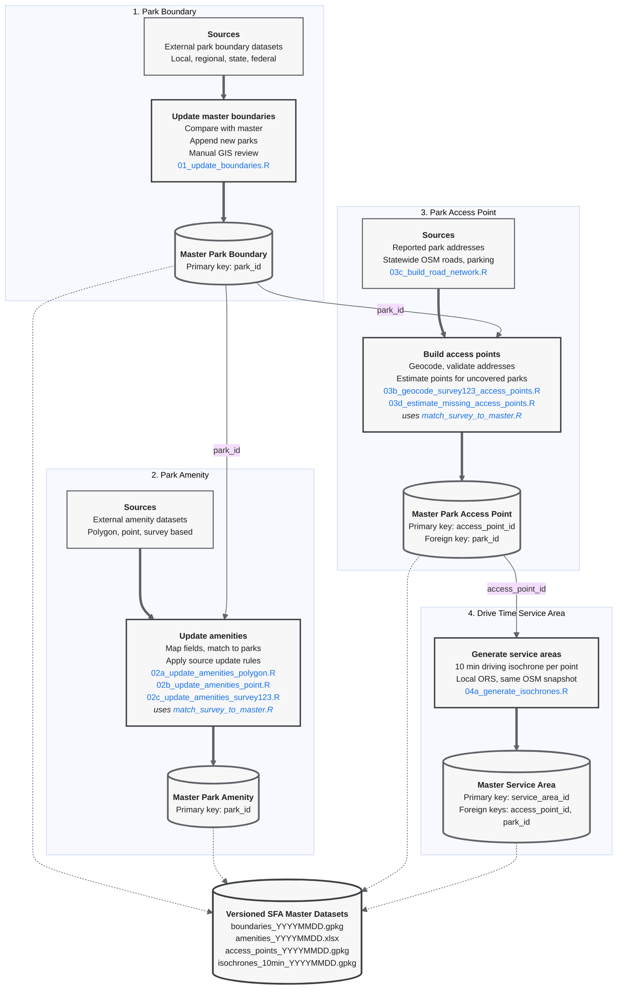

# SFA Master Dataset Workflow
 
This repository contains the R scripts used to build and maintain the versioned master datasets for the Strive for Access project. The workflow produces four linked datasets:
 
1. Park boundary dataset
2. Park amenity dataset
3. Park access point dataset
4. Drive time service area dataset

Input and output paths are set in the CONFIG section of each script and updated per run. Every run writes a new dated version, and repeated runs on the same day are suffixed `_1`, `_2` to avoid overwriting. Stable identifiers are preserved across versions so that records can be linked between datasets.

## Data Processing Workflow



## Dataset Relationships
 
All identifiers share one format: a 12 character hexadecimal string generated with `ids::random_id(bytes = 6)`.
 
The park boundary dataset provides the authoritative park geometry and `park_id`. Existing ids are never regenerated; new parks receive new ids when appended.
 
The amenity dataset contains one record per park and uses `park_id` as its primary key. Its rows are kept aligned with the boundary dataset: parks appended to the boundaries receive empty amenity rows on the next amenity update.
 
The access point dataset may contain multiple access points per park. Each record has a unique `access_point_id` and links to its park through `park_id`. The `GIS_SRC` field records how each point was obtained (Survey123 geocoding or one of the estimation methods).
 
The service area dataset contains one 10 minute driving isochrone per access point. Each record has a unique `service_area_id` and links back through `access_point_id` and `park_id`.


## Versioned Outputs
 
```text
Data/
  master/
    boundaries/
      boundaries_YYYYMMDD.gpkg
    amenities/
      amenities_YYYYMMDD.xlsx
    access_points/
      access_points_YYYYMMDD.gpkg
    service_areas/
      isochrones_10min_YYYYMMDD.gpkg
  roads/
    nc_roads_ors.gpkg        # statewide ORS filtered road network (03c)
    nc_parking.gpkg          # statewide OSM parking points (03c)
    osm_cache/               # Geofabrik NC extract shared by 03c, 03d, 04a
```

## Processing Scripts
 
```text
Scripts/
  01_update_boundaries.R                  # append new parks from an external boundary source
  02a_update_amenities_polygon.R          # amenity update from a polygon source (area overlap match)
  02b_update_amenities_point.R            # amenity update from a point source (point in polygon match)
  02c_update_amenities_survey123.R        # amenity update from the 7 regional Survey123 servers
  03b_geocode_survey123_access_points.R   # geocode Survey123 addresses into access points
  03c_build_road_network.R                # build statewide roads and parking from the Geofabrik extract
  03d_estimate_missing_access_points.R    # estimate access points for uncovered parks, 100 county loop
  04a_generate_isochrones.R               # 10 minute driving isochrones via a local ORS instance
  match_survey_to_master.R                # shared point to park matching, used by 02c and 03b
```

## Notes
 
- Roads, parking, access point estimation, and isochrones are all derived from a single Geofabrik OSM snapshot, so the layers stay mutually consistent. Rebuilding from a newer snapshot means rerunning 03c, then 03d, then 04a.
- Survey123 responses left at a region's default map location are excluded throughout, since an unmoved pin carries no location information.
- 04a requires a local openrouteservice Docker container built from the same extract; see the script header for the run command.
- Update sources and record counts are tracked per batch in the master update tracking sheet.


# Park Access Points, Drive Time Isochrones, and Survey123 Template

This repository provides reusable Strive for Access materials, including R workflows for generating park access points and 10 minute drive time isochrones, along with a Survey123 XLSForm template for local park and recreation data collection.

## Overview

The repository includes two main components:

1. R scripts for generating a filtered road network, park access points, and 10 minute driving isochrones.
2. A Survey123 XLSForm template that local agencies can download, customize, and publish within their own ArcGIS organization.

The R workflow produces three spatial outputs:

1. A road network filtered for vehicle accessibility, used as the basis for access point generation.
2. A point layer of plausible access locations for each park polygon.
3. A polygon layer of 10 minute driving isochrones around those access points, generated via OpenRouteService.

The access point logic uses a four step fallback so that every park polygon receives at least one access point, even when no formal entrance or parking lot exists in the source data.

## Scripts

### 00_ors_roads_filter.R

Generates a county level road network suitable for park access point estimation, adapted from the [OpenRouteService driving-car tag filtering profile](https://giscience.github.io/openrouteservice/technical-details/tag-filtering#driving-car). The script is parameterized by county and state, so it can be reused for any U.S. county.

Key features:

- Pulls the official TIGER/Line county boundary via tigris and uses it for both the Overpass query bounding box and a final clip step, avoiding the boundary spillover that occurs when querying by place name through Nominatim.
- Replicates the ORS driving-car rules for road type, ford crossings, track grade, impassable status, and width, with two project specific modifications: motorway is removed (park entrances rarely connect directly to controlled-access highways, though motorway_link is retained for interchange ramps), and restricted access values are treated as a hard reject except for access=forestry, which is preserved so that state forest and game land access roads are not falsely excluded.
- Outputs a cleaned road network to ./Data/{county}/{county}_roads_ors.geojson, where {county} is the lowercased county name.

### 01_generate_access_points_wake.R

Generates one or more access points per park polygon using the following fallback order:

1. Known entrances from an existing public access point dataset, assigned to the nearest park polygon.
2. OSM parking locations identified with amenity=parking, using centroids that fall inside the remaining parks and clustering points within 50 m to avoid duplicates.
3. Boundary intersections between park boundaries and the road network, also clustered within 50 m.
4. Snapped points projected from the park polygon onto the nearest road, used as a last resort.

Each output point carries a PointID, the parent SiteID, and a source field indicating which step produced it. An interactive tmap preview is included for visual inspection.

### 02_generate_iso10min_wake.R

Generates 10 minute driving isochrones for each access point using the OpenRouteService API.

Key features:

- Loops through access points with a 1.5 second delay to respect API rate limits.
- Saves a checkpoint every 50 points so long runs can be resumed if interrupted.
- Tracks failed requests separately for later inspection.

## Survey123 Template

This repository also includes Strive4Access_Survey123.xlsx, an XLSForm template that can be used to create a local park and recreation data collection survey in ArcGIS Survey123.

The template is intended to help local agencies adapt the Strive for Access survey structure for their own parks, facilities, and recreation assets. Users can download the file, modify the survey choices, and publish the form within their own ArcGIS organization.

### How to use the template

1. Download Strive4Access_Survey123.xlsx from this repository.
2. Open ArcGIS Survey123 Connect.
3. Click New Survey, choose the File option, and browse to the downloaded .xlsx file.
4. Once the survey is loaded, click the XLSForm icon to edit the template.
5. Update the choices tab with local park names, facilities, amenities, or other locally relevant attributes.
6. Click Publish to deploy the survey within your own ArcGIS organization.

## Inputs

The R scripts assume the following files under ./Data/:

- RecLandsAll.geojson: park polygons covering the study region.
- Parks_in_Wake_County.geojson: known public access points.

County boundaries are pulled from tigris. The road network is produced by script 00. Parking data is queried live from OpenStreetMap via osmdata.

## Outputs

The R workflow produces the following outputs (paths shown for Wake County; the road network script generalizes to any county):

- Data/wake/wake_roads_ors.geojson: filtered road network for the county.
- Data/Wake/wake_polygons.geojson: park polygons clipped to the county, with assigned SiteID.
- Data/Wake/wake_access_points.geojson: combined access points from all four steps.
- Data/Wake/wake_iso10min_checkpoint.geojson: 10 minute drive time isochrones, which also serve as the resumable checkpoint.

## Dependencies

R packages:

- sf
- dplyr
- tidyverse
- purrr
- osmdata
- tigris
- tmap
- uuid
- lwgeom
- openrouteservice

An OpenRouteService API key is required for script 2. Set it in your R session before running:

```r
library(openrouteservice)
ors_api_key("YOUR_KEY")
```
