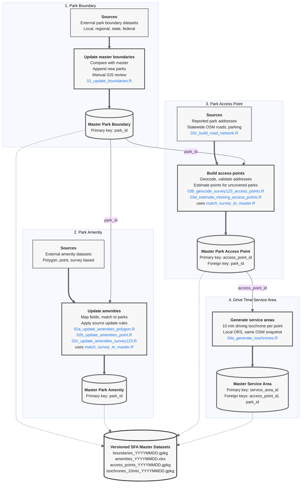

# SFA Master Dataset Workflow
 
This repository contains the R scripts used to build and maintain the versioned master datasets for the Strive for Access project. The workflow produces four linked datasets:
 
1. Park boundary dataset
2. Park amenity dataset
3. Park access point dataset
4. Drive time service area dataset

Input and output paths are set in the CONFIG section of each script and updated per run. Every run writes a new dated version, and repeated runs on the same day are suffixed `_1`, `_2` to avoid overwriting. Stable identifiers are preserved across versions so that records can be linked between datasets.

## Data Processing Workflow



## Dataset Relationships
 
All identifiers share one format: a 12 character hexadecimal string generated with `ids::random_id(bytes = 6)`.
 
The park boundary dataset provides the authoritative park geometry and `park_id`. Existing ids are never regenerated; new parks receive new ids when appended.
 
The amenity dataset contains one record per park and uses `park_id` as its primary key. Its rows are kept aligned with the boundary dataset: parks appended to the boundaries receive empty amenity rows on the next amenity update.
 
The access point dataset may contain multiple access points per park. Each record has a unique `access_point_id` and links to its park through `park_id`. The `GIS_SRC` field records how each point was obtained (Survey123 geocoding or one of the estimation methods).
 
The service area dataset contains one 10 minute driving isochrone per access point. Each record has a unique `service_area_id` and links back through `access_point_id` and `park_id`.


## Versioned Outputs
 
```text
Data/
  master/
    boundaries/
      boundaries_YYYYMMDD.gpkg
    amenities/
      amenities_YYYYMMDD.xlsx
    access_points/
      access_points_YYYYMMDD.gpkg
    service_areas/
      isochrones_10min_YYYYMMDD.gpkg
  roads/
    nc_roads_ors.gpkg        # statewide ORS filtered road network (03c)
    nc_parking.gpkg          # statewide OSM parking points (03c)
    osm_cache/               # Geofabrik NC extract shared by 03c, 03d, 04a
```

## Processing Scripts
 
```text
Scripts/
  01_update_boundaries.R                  # append new parks from an external boundary source
  02a_update_amenities_polygon.R          # amenity update from a polygon source (area overlap match)
  02b_update_amenities_point.R            # amenity update from a point source (point in polygon match)
  02c_update_amenities_survey123.R        # amenity update from the 7 regional Survey123 servers
  03b_geocode_survey123_access_points.R   # geocode Survey123 addresses into access points
  03c_build_road_network.R                # build statewide roads and parking from the Geofabrik extract
  03d_estimate_missing_access_points.R    # estimate access points for uncovered parks, 100 county loop
  04a_generate_isochrones.R               # 10 minute driving isochrones via a local ORS instance
  match_survey_to_master.R                # shared point to park matching, used by 02c and 03b
```

## Notes
 
- Roads, parking, access point estimation, and isochrones are all derived from a single Geofabrik OSM snapshot, so the layers stay mutually consistent. Rebuilding from a newer snapshot means rerunning 03c, then 03d, then 04a.
- Survey123 responses left at a region's default map location are excluded throughout, since an unmoved pin carries no location information.
- 04a requires a local openrouteservice Docker container built from the same extract; see the script header for the run command.
- Update sources and record counts are tracked per batch in the master update tracking sheet.
