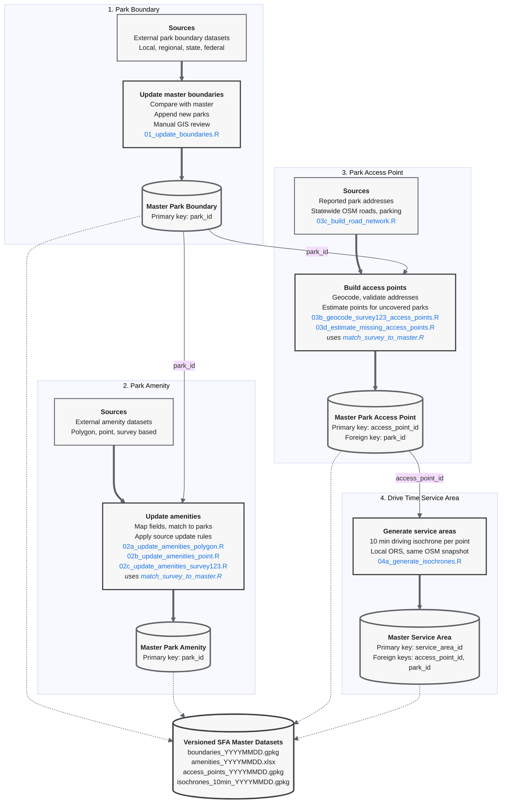

# SFA Master Dataset Workflow
 
This repository contains the R scripts used to build and maintain the versioned master datasets for the Strive for Access project. The workflow produces four linked datasets:
 
1. Park boundary dataset
2. Park amenity dataset
3. Park access point dataset
4. Drive time service area dataset

Input and output paths are set in the CONFIG section of each script and updated per run. Every run writes a new dated version, and repeated runs on the same day are suffixed `_1`, `_2` to avoid overwriting. Stable identifiers are preserved across versions so that records can be linked between datasets.

## Data Processing Workflow



## Dataset Relationships
 
All identifiers share one format: a 12 character hexadecimal string generated with `ids::random_id(bytes = 6)`.
 
The park boundary dataset provides the authoritative park geometry and `park_id`. Existing ids are never regenerated; new parks receive new ids when appended.
 
The amenity dataset contains one record per park and uses `park_id` as its primary key. Its rows are kept aligned with the boundary dataset: parks appended to the boundaries receive empty amenity rows on the next amenity update.
 
The access point dataset may contain multiple access points per park. Each record has a unique `access_point_id` and links to its park through `park_id`. The `GIS_SRC` field records how each point was obtained (Survey123 geocoding or one of the estimation methods).
 
The service area dataset contains one 10 minute driving isochrone per access point. Each record has a unique `service_area_id` and links back through `access_point_id` and `park_id`.


## Versioned Outputs
 
```text
Data/
  master/
    boundaries/
      boundaries_YYYYMMDD.gpkg
    amenities/
      amenities_YYYYMMDD.xlsx
    access_points/
      access_points_YYYYMMDD.gpkg
    service_areas/
      isochrones_10min_YYYYMMDD.gpkg
  roads/
    nc_roads_ors.gpkg        # statewide ORS filtered road network (03c)
    nc_parking.gpkg          # statewide OSM parking points (03c)
    osm_cache/               # Geofabrik NC extract shared by 03c, 03d, 04a
```

## Processing Scripts
 
```text
Scripts/
  01_update_boundaries.R                  # append new parks from an external boundary source
  02a_update_amenities_polygon.R          # amenity update from a polygon source (area overlap match)
  02b_update_amenities_point.R            # amenity update from a point source (point in polygon match)
  02c_update_amenities_survey123.R        # amenity update from the 7 regional Survey123 servers
  03b_geocode_survey123_access_points.R   # geocode Survey123 addresses into access points
  03c_build_road_network.R                # build statewide roads and parking from the Geofabrik extract
  03d_estimate_missing_access_points.R    # estimate access points for uncovered parks, 100 county loop
  04a_generate_isochrones.R               # 10 minute driving isochrones via a local ORS instance
  match_survey_to_master.R                # shared point to park matching, used by 02c and 03b
```

## Notes
 
- Roads, parking, access point estimation, and isochrones are all derived from a single Geofabrik OSM snapshot, so the layers stay mutually consistent. Rebuilding from a newer snapshot means rerunning 03c, then 03d, then 04a.
- Survey123 responses left at a region's default map location are excluded throughout, since an unmoved pin carries no location information.
- 04a requires a local openrouteservice Docker container built from the same extract; see the script header for the run command.
- Update sources and record counts are tracked per batch in the master update tracking sheet.

| Scenario | Input or condition | Processing sequence | Affected datasets | Processing method |
|---|---|---|---|---|
| **A. Park Inventory Change** | New park polygon from an external source | `01_update_boundaries.R` → prepare amenity record → `03d_estimate_missing_access_points.R` → `04_generate_isochrones.R` → `05_create_exb_data.R` | Boundaries, Amenities, Access Points, Service Areas | **Script + manual review.** `01_update_boundaries.R` can ingest new polygon sources. Amenity records may be prepared manually or through the appropriate amenity workflow depending on the source. |
| **A. Park Inventory Change** | Park identified through Survey123 but absent from the boundary master | Identify or obtain the correct polygon → add polygon to boundary master → assign new `park_id` → rerun relevant amenity and access point procedures → `04_generate_isochrones.R` → `05_create_exb_data.R` | Potentially all four master datasets | **Manual + Script.** Polygon identification, creation, and review are handled in ArcGIS Pro or ArcGIS Online. Existing scripts are then used for downstream processing. |
| **A. Park Inventory Change** | Existing park changes, including boundary, name, ownership, closure, merger, or division | Edit approved boundary master → determine whether amenities or access points are affected → regenerate affected downstream data → `05_create_exb_data.R` | Depends on the type of change | **Manual + Script.** These changes generally require case specific review and are best handled through ArcGIS Pro or ArcGIS Online, followed by the relevant downstream scripts. |
| **B. Amenity Information Change** | Polygon based external amenity source | `02a_update_amenities_polygon.R` → `05_create_exb_data.R` | Amenities | **Automated + review.** Source specific field mappings and configuration should be checked before running the script. |
| **B. Amenity Information Change** | Point based external amenity source | `02b_update_amenities_point.R` → `05_create_exb_data.R` | Amenities | **Automated + review.** Amenity field mappings and spatial matching settings should be checked for the incoming source. |
| **B. Amenity Information Change** | New or updated Survey123 amenity responses | `02c_update_amenities_survey123.R` → `05_create_exb_data.R` | Amenities | **Automated + review.** Responses matched to exactly one park are processed automatically. Unmatched and multiple match records require manual review. |
| **B. Amenity Information Change** | Manual correction to an existing amenity record | Edit amenity master → QA/QC → `05_create_exb_data.R` | Amenities | **Manual + Script.** Small corrections can be made directly in the master amenity table after confirming the correct `park_id`. |
| **C. Access Point Change** | New external entrance, parking, or access point source | `03a_update_external_access_points.R` → `04_generate_isochrones.R` → `05_create_exb_data.R` | Access Points, Service Areas | **Automated + review.** The script links incoming points to parks and checks for nearby duplicate access points. |
| **C. Access Point Change** | Park has no verified access point | `03d_estimate_missing_access_points.R` → `04_generate_isochrones.R` → `05_create_exb_data.R` | Access Points, Service Areas | **Automated estimation + QA/QC.** Access points are estimated using OSM parking, road boundary intersections, and road snapping in hierarchical order. |
| **C. Access Point Change** | Survey123 provides a usable park address or access location | Geocode and validate location → append approved access point to master → `04_generate_isochrones.R` → `05_create_exb_data.R` | Access Points, Service Areas | **Manual + existing geocoding logic.** `03b_geocode_survey123_access_points.R` contains the relevant geocoding and validation procedures, although the current script was originally designed for initial master construction. |
| **C. Access Point Change** | Existing access point is corrected or removed | Edit access point master → remove or replace affected service area → regenerate affected isochrone as needed → `05_create_exb_data.R` | Access Points, Service Areas | **Manual + Script.** Point corrections or removals can be handled in ArcGIS Pro or ArcGIS Online. Corresponding service areas should then be synchronized. |
| **D. Downstream Refresh and Publication** | Amenity information changed but access points did not | `05_create_exb_data.R` | Downstream application data | **Automated downstream refresh.** Service area regeneration is not required. |
| **D. Downstream Refresh and Publication** | Access points were added or changed | `04_generate_isochrones.R` → `05_create_exb_data.R` | Service Areas, downstream application data | **Automated + review.** Updated access points require corresponding service area generation or replacement before application data are rebuilt. |
| **D. Downstream Refresh and Publication** | Updated master datasets are approved for publication | `05_create_exb_data.R` → update hosted feature layers → verify web maps → verify application | Hosted layers, web maps, application | **Script + manual publication verification.** Hosted layer updates and final application checks can be completed through ArcGIS Online unless additional automation is later implemented. |

